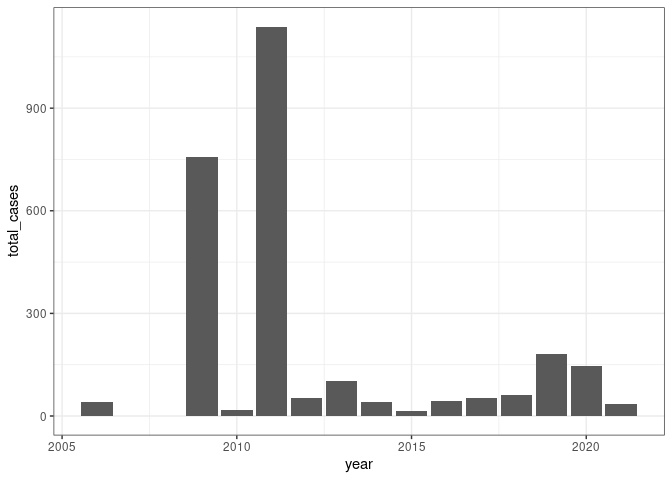
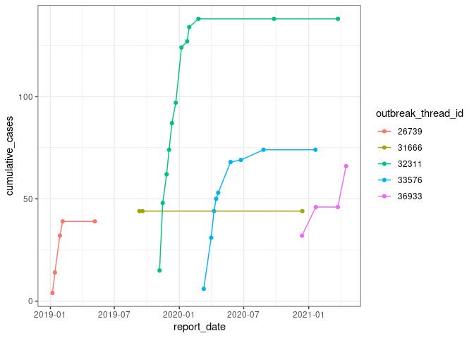

Welcome Veronica and David!

For your first couple days, you will be doing exploratory data analysis using our `repeldata` package. The goal is for you to become familiar with the data set and to start exploring interesting features and trends.

You'll be working primarily with data from the OIE World Animal Health Information System (WAHIS). Briefly familiarize yourself with the website (https://wahis.oie.int/#/home). Click on the _by report_ link (https://wahis.oie.int/#/report-management) and look at some example animal disease event reports and six-monthly reports (from the tables, click on the eyes in the far-right column to see full reports). Our database standardizes the data from these reports. 

To start working with `repeldata`, follow installation and download instructions from the package README. 

I suggest starting your EDA with the outbreak tables. These are from the animal disease event reports, which are released (more or less) in real time as disease outbreaks occur. There are two relevant tables.

 - `outbreak_reports_events` is a high level summary of each report. It tells you the disease, country, and date of the report. Each row is a report with its own unique `report_id`. If you want to see the formatted report on the OIE website, enter the value from the `url_report_id` field at the end of this url https://wahis.oie.int/#/report-info?reportId=[url_report_id]. Most outbreaks have more than one report, depending on the duration. New reports may be released to record new cases or report new outbreak control efforts. Outbreak "threads" are tracked by the `outbreak_thread_id` field. When an outbreak ends or becomes endemic (i.e., is no longer tracked as an outbreak), the field `is_final_report` will be TRUE. 

 - `outbreak_reports_outbreaks` has more detailed information from the reports. It can be joined with `outbreak_reports_events` by the `report_id` field. Here, data are broken out by location (with a unique `outbreak_location_id` and `latitude`/`longitude`) and by taxa (`species_name`). There are fields for number of susceptible, cases, deaths, killed and disposed, slaughtered for commercial use, and vaccinated. Note that these counts represent new values--cumulative counts need to be calculated. There is also a `control_measures` field, where values are `;` separated.

There is a lot to explore with this data, including duration, magnitude of certain endpoints, spatial coverage. To get started, you may want to focus on a specific disease and country. Below is some example code to get started.


```r
library(repeldata)
library(dbplyr)
library(dplyr)
library(lubridate)
library(ggplot2)

# connect to database
conn <- repel_local_conn()

# events table
# let's focus on FMD in South Africa - apply filters then read into memory
events <- tbl(conn, "outbreak_reports_events") %>% 
    filter(disease == "foot-and-mouth disease",
           country_iso3c == "ZAF") %>% 
    collect()

# outbreak table
# let's focus on cattle - again applying filters first
outbreaks <- tbl(conn, "outbreak_reports_outbreaks") %>% 
    filter(report_id %in% !!events$report_id) %>% 
    filter(species_name == "cattle") %>%
    collect()

# join two tables
event_outbreaks <- inner_join(events, outbreaks, by = "report_id")

# add a field for year 
event_outbreaks <- event_outbreaks %>% 
    mutate(year = lubridate::year(report_date)) 

# quick look at total cases of FMD by year in South Africa
event_outbreaks %>% 
    group_by(year) %>% 
    summarize(total_cases = sum(cases)) %>% 
    ungroup() %>% 
    ggplot(aes(x = year, y = total_cases)) + 
    geom_col() +
    theme_bw()
```

<!-- -->

```r
# a deeper look at outbreak curves since 2019
event_outbreaks %>%
    filter(year >= 2019) %>% 
    group_by(outbreak_thread_id) %>% 
    mutate(cumulative_cases = cumsum(cases)) %>%  # calculate cumulative cases by outbreak
    group_by(outbreak_thread_id, report_date) %>% 
    summarize(cumulative_cases = max(cumulative_cases)) %>% # this is effectively summarizing over multiple sublocations within the outbreak 
    ungroup() %>% 
    ggplot(aes(x = report_date, y = cumulative_cases, color = outbreak_thread_id)) +
    geom_point() + 
    geom_line() +
    theme_bw()
```

<!-- -->


This should be plenty to start with! There will be many other tables in the database to explore, including annual report tables and a bunch of supporting data (e.g., tradestats, worldbank indicators). For now, don't hesitate to ask any questions. We'll connect on Wednesday for a walk-through. Cheers! 
